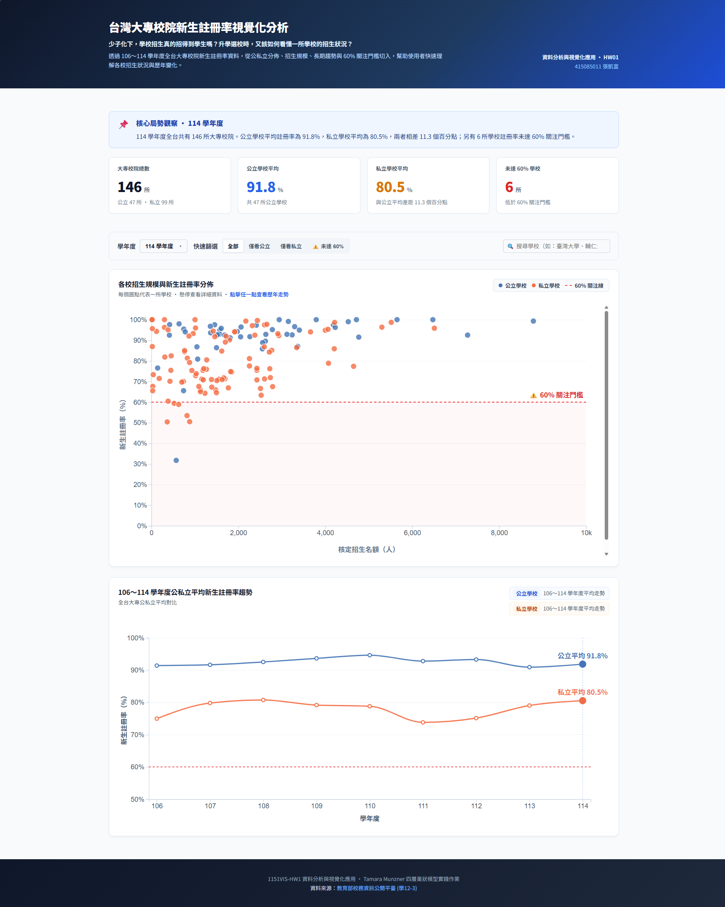

# 📝 HW01 作業說明

> **課程**：資料分析與視覺化應用｜輔仁大學資工所  
> **學號姓名**：415085011 CHANG-KAI-FU  
> **GitHub**：[1151VIS-HW1-415085011-CHANG-KAI-FU](https://github.com/415085011/1151VIS-HW1-415085011-CHANG-KAI-FU)

---

## 📸 專案執行成果展示

<!-- 待完成後截圖放入 docs/screenshot.png -->
> 

---

## 🛠️ 開發環境與技術棧

| 項目 | 版本／說明 |
|:---|:---|
| 建置工具 | Vite 8.x |
| 核心框架 | Vue 3（Composition API / `<script setup>`）|
| 視覺化函式庫 | D3.js v7.x |
| 視覺化理論架構 | Tamara Munzner《Visualization Analysis and Design》四層巢狀模型 |

---

## 📖 製作流程（Munzner 四層巢狀分析框架）

### Level 1：領域情境（Domain Situation）

- **目標受眾**：高中生與家長（評估學校招生健康度）、教育政策研究者
- **核心問題**：「少子化浪潮下，台灣大專院校的新生招生狀況如何？公私立之間的命運是否出現分歧？有多少學校已瀕臨退場警戒線？」
- **資料來源**：教育部大專校院校務資訊公開平臺  
  `學12-3. 新生（含境外生）註冊率－以「校」統計`（106～114 學年度，共 1,382 筆）

---

### Level 2：資料抽象化（Data Abstraction）

**Items（資料實體）**：每一筆 = 某學年度的某所學校（1,382 筆）

| 欄位名稱 | 視覺化屬性分類 | 語意說明 |
|:---|:---|:---|
| 學年度 | Ordered / Temporal（Key）| 106～114，共 9 年 |
| 設立別 | Categorical（Key）| 公立 / 私立（2 levels）|
| 學校類別 | Categorical | 一般大學 / 技專校院 / 宗教研修學院 |
| 學校名稱 | Categorical（Key）| 169 所唯一識別 |
| 核定招生名額(A) | Quantitative | 學校招生規模（X 軸）|
| 實際註冊人數(C) | Quantitative | 用以計算缺額 |
| **新生註冊率(%)** | **Quantitative（核心）** | 最重要指標（Y 軸）|

**衍生指標（Derive）**：
- `招生缺額` = 核定名額 - 實際註冊人數
- `危機分級`：< 60% → 退場警戒；60~80% → 需關注；≥ 80% → 健康

---

### Level 2：任務抽象化（Task Abstraction）

| # | 領域問題 | Action | Target |
|:---:|:---|:---:|:---:|
| Task 1 | 公立與私立學校的招生狀況有何差距？ | Compare | Distribution |
| Task 2 | 哪些學校已跌破 60% 退場警戒線？ | Locate | Outliers |
| Task 3 | 隨著時間推移，整體趨勢如何演變？ | Discover | Trends |

---

### Level 3：視覺編碼設計（Visual Idiom）

#### 主圖：散佈圖（各校新生招生概況）

| 視覺通道 | 對應屬性 | 設計理由 |
|:---|:---|:---|
| X 軸位置 | 核定招生名額 | 學校規模，空間通道效能最高 |
| Y 軸位置 | 新生註冊率（0～100%）| 核心指標，Y 軸完整不截斷 |
| 色相（Hue）| 設立別（公立/私立）| 藍色=公立、橘色=私立（色盲安全配色）|
| 參考線 | Y = 60%（退場警戒）| 紅色虛線，直觀呈現危機分界 |
| Hover Tooltip | 學校名稱、名額、率、缺額 | 按需細節（Details on Demand）|

#### 副圖：折線圖（公私立平均走勢，106～114 學年度）

| 視覺通道 | 對應屬性 |
|:---|:---|
| X 軸 | 學年度（Ordered Temporal）|
| Y 軸 | 各年度平均新生註冊率 |
| 2 條折線 | 公立（藍）vs 私立（橘）|

---

### Level 4：實作（D3.js + Vue 3）

#### 專案結構

```
hw01/
├── public/data/
│   └── 學12-3.新生(含境外生)註冊率-以「校」統計.csv  # 官方原始資料
├── src/
│   ├── App.vue                        # 主佈局（學年度選單 + 雙圖並排）
│   ├── components/
│   │   ├── ScatterPlot.vue            # 主散佈圖元件
│   │   └── TrendLine.vue              # 副折線圖元件
│   └── composables/
│       └── useEnrollmentData.js       # 資料載入、清洗與衍生指標
```

#### 關鍵技術決策

1. **D3 × Vue 3 分工**：Vue 管理狀態與 Props 流向，D3 僅負責 SVG 幾何計算與繪製（不操作 Vue 響應式系統）
2. **Margin Convention**：所有圖表採用標準 `{top, right, bottom, left}` margin 群組偏移
3. **Data Join**：以 `year-schoolCode` 作為 key function 確保重繪穩定性
4. **衍生指標**：`招生缺額`、`危機分級` 在 Composable 層計算，元件層只做渲染

---

### 🎨 前端設計與 UI/UX 體驗實踐（Anti-Slop Modern Design）

本專案拒絕平庸模板化的 AI 界面，全面導入頂級前端設計準則：

1. **資訊架構與 Hero KPI 卡片**：
   - 在圖表上方設置 **4 大關鍵數據摘要卡**（調查學校數、退場警戒校數、關注校數、全國平均註冊率），讓使用者在 3 秒內掌握核心情勢。
2. **微互動與焦點聚焦（Focus & Dimming）**：
   - 當滑鼠懸停特定學校時，焦點圓點放大至 `r=8.5` 並加入高對比外框，其餘 140+ 所非焦點學校自動微淡化至 `opacity=0.18`，一眼鎖定該校在全國的分佈定位。
3. **深冷半透明毛玻璃 Tooltip**：
   - 採用 Slate 950 半透明（`rgba(15, 23, 42, 0.94)`）搭配 `backdrop-filter: blur(10px)`，資訊包含學校體系、註冊率、核定名額與招生缺額，並具備智能邊界防溢出判定。
4. **8pt 間距網格與繁體中文舒適字級**：
   - 拒絕純黑（#000），使用 Slate 900 / 600 / 400 構建清晰字體層級；全站文字全面依據繁體中文多筆畫結構進行尺寸優化（13px~18px），告別歐美 11px 糊字陷阱。
5. **上下縱向敘事排版（Stacked Narrative Layout）**：
   - 採大器寬敞的上下全寬佈局（畫布拓寬至 1000px），散佈圖圓點享有充足橫向間距，不壓迫擁擠；折線圖展開為寬螢幕 9 年時間全景，圖表由上至下敘事連貫自然。

---

## 📌 操作說明

```bash
# 安裝依賴
npm install

# 啟動開發伺服器
npm run dev
# → http://localhost:5173/

# 建置正式版本
npm run build
```

**操作步驟與探索指引**：
1. 開啟 `http://localhost:5173/`（或 `http://localhost:5174/`）
2. **頂部新聞導讀與 KPI**：觀察當學年度公私立鴻溝與退場警戒校數變化。
3. **膠囊屬性過濾**：點擊「僅看公立」、「僅看私立」或「⚠️ 警戒校 (<60%)」快速聚焦特定群體。
4. **代表性學校直接標記**：散佈圖自動標記「臺灣大學」、「輔仁大學」與當年度最低註冊率之警戒校，免操作即可掌握象限分佈。
5. **學校搜尋與快捷探針**：於右上角搜尋框輸入校名（如「輔仁」、「成大」），或點選快捷標籤，目標學校即刻高亮跳動。
6. **深度雙圖聯動（Linked Views）**：點擊散佈圖任一學校圓點，下方折線圖即刻動態疊加該校 106～114 學年度的 9 年專屬歷史軌跡線，一覽其與公私立平均線的命運對比！
